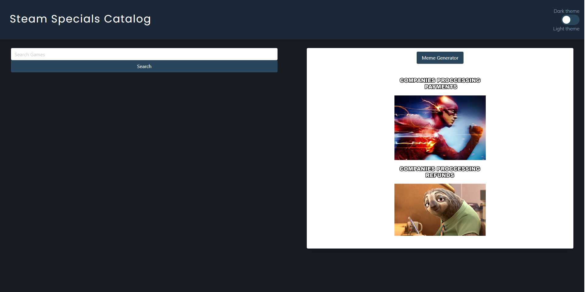
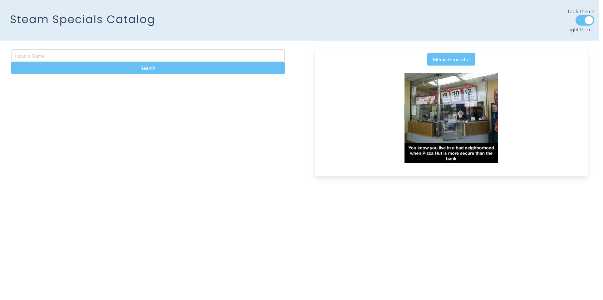
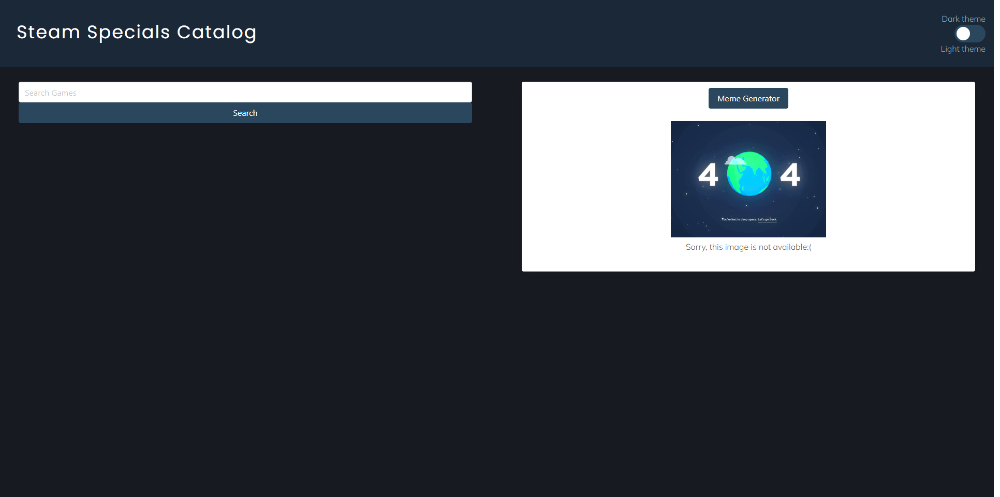
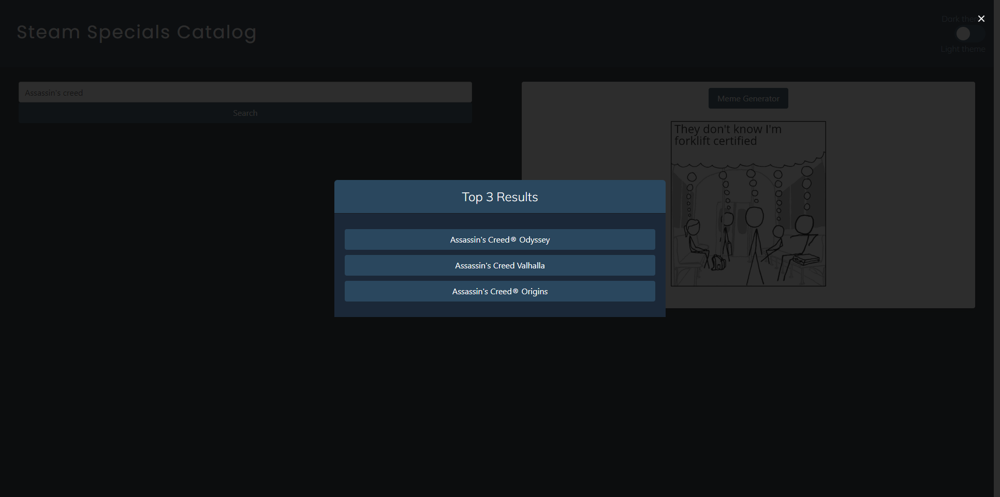
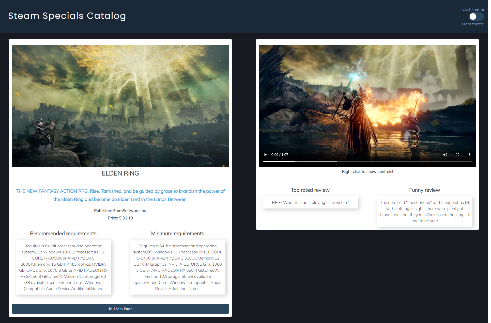

# Steam-Specials-Catalogue

## Description 
In making this site we wanted to create a simple, user friendly catalogue to browse steam games and determine whether they are on sale. You`ll be given details on the game, reviews and the current price of the game.

## Installation 
To install this project simply clone the repository and then open code with the use of a code editor such as visual studio. You can also visit the deployed page from my github page or from the link here


```
git clone git@github.com:T0ny-Macaroni/Steam-Specials-Catalogue.git
```
Deployed Site: https://t0ny-macaroni.github.io/Steam-Specials-Catalogue/

Dark Theme


--- 
Light Theme


---
Meme generator (image is not available)


---
Modal top 3 searches


---
Details Page



## Usage
Opening this page in a browser will allow you to easily search a game using a key-word and after specifying what youre looking for youll be presented
with detailed information on the chosen game including images and a video as well as descriptions, price and reviews for said game.

## Credits
Alina Badillo: [GitHub](https://github.com/AlinaB108)

Jared Brymer: [GitHub](https://github.com/Turbdorb)

Tony Giuliani: [GitHub](https://github.com/T0ny-Macaroni)

APIs we used (from RapidApi): 

[Games Details](https://rapidapi.com/asusalman986/api/games-details/)

[Meme Generator](https://rapidapi.com/eximia-eximia-default/api/meme-generator-and-template-database)

[Bulma](https://bulma.io/documentation/overview/start/)

[ColorsWall](https://colorswall.com/palette/193)

UT Coding Bootcamp (starter code for toggle switch)

---


